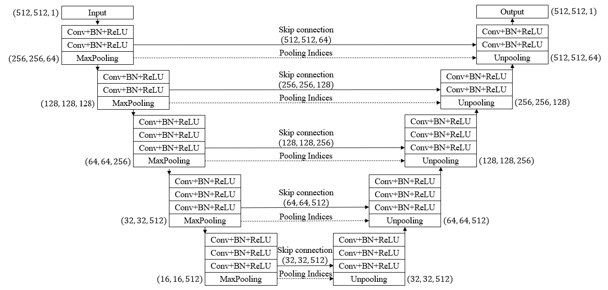

# Implementation of OTSNet using PyTorch Deep Learning Framework
 
The architecture was inspired by Effective encoder-decoder neural network for segmentation of orbital tissue in computed tomography images of Graves’ orbitopathy patients. 

## Overview
This repository contains an official implementation of OTSNet using PyTorch.<br/>
Please refer to the paper at the following page: 
[Effective encoder-decoder neural network for segmentation of orbital tissue in computed tomography images of Graves’ orbitopathy patients]([https://ieeexplore.ieee.org/document/8964956?denie]](https://journals.plos.org/plosone/article?id=10.1371/journal.pone.0285488) "Visit")

## Model

## Paper
If you use this software for your research, please cite:

```bibtex
@article{lee2023effective,
  title={Effective encoder-decoder neural network for segmentation of orbital tissue in computed tomography images of Graves’ orbitopathy patients},
  author={Lee, Seung Hyeun and Lee, Sanghyuck and Lee, Jaesung and Lee, Jeong Kyu and Moon, Nam Ju},
  journal={Plos one},
  volume={18},
  number={5},
  pages={e0285488},
  year={2023},
  publisher={Public Library of Science San Francisco, CA USA}
}
```

## License
This program is available for download for non-commercial use, licensed under the GNU General Public License. This allows its use for research purposes or other free software projects but does not allow its incorporation into any type of commercial software.

## Files
The repository contains the following files:

- `OTSNet.py`: Python script file, containing the PyTorch implementation of the OTSNet.
- `README.md`: Markdown file explaining the model source code.
